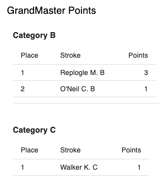

# Creating a Points Engine with AI assistance

You can kickstart creation of a custom points enging by using AI to generate the first version and tweaking that with either your own code or iterative AI prompts.

The prompt below demonstrates how to create a points engine that accumulates individual masters points in each masters category as well as a jest test to help debug and test the code.

Use of this prompt is shown with [this ChatGPT query](https://chatgpt.com/share/68dacd9e-2874-8008-9d82-029dc79007e5).

```txt
Examine https://github.com/crewtimer/crewtimer-common
 for the type Results which has a field results: Event[] where Event has fields EventNum, Event, and entries: Entry[]. Each Entry has a Place and a Stroke.

Examine https://github.com/crewtimer/crewtimer-points
 and its README for how to use the genPlaces and isAFinal helpers. Also look at the SimpleTeamPoints.tsx and SimpleTeamPointsCalc.ts files to follow the same API and folder structure.

Create a new points system called GrandMaster Points:

- Calculator is passed a Results object.
- Each unique Stroke is grouped by the trailing category AA or A–K preceded by a space and with no trailing punctuation. If no valid suffix, ignore that stroke.
- Points: 3 for 1st, 2 for 2nd, 1 for 3rd.
- Only count races that are A finals using isAFinal(eventName, eventNum).
- Group and sum by category AA,A–K. Sort descending by points inside each category.
- Use genPlaces(points, 'desc') to compute placement (tie aware).

Build:

1. Calculation engine
2. A React UI component GrandMasterPoints.tsx that shows one continuous vertical table: each non-empty category starts with a “Category X” header and a table with columns Place / Stroke / Points. categories with no entries are omitted. The table should:
 - 400px width.
 - Print nicely (each category stays on the same page; no page breaks inside a category).
3. Show how to register this new UI in src/index.ts next to FIRAPointsTraditional 
4. Add a Jest test file covering:
- Filtering to A finals only
- Correct 3/2/1 scoring
- Ignoring invalid strokes
- Tie handling (via genPlaces)

Use the same folder structure and conventions as existing calculators and viewers.
```


